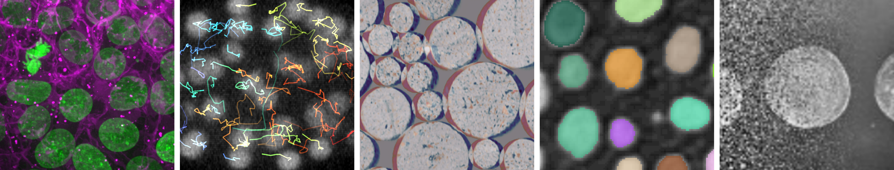

# Awesome Scientific Image Analysis 

Scientific image analysis addresses issues related to the acquisition, processing, storage, visualization, and extraction of quantitative measurements from images.

Contributions to this list are welcome (➡️ [contributing.md](./contributing.md)). Add your resource suggestions via pull requests or create an issue to start a discussion.

## Contents

- [🔖 Getting started](#-getting-started)
- [🧑‍🤝‍🧑 Communities](#-communities)
- [📚 Learning resources](#-learning-resources)
- [✂️ Image segmentation](#-image-segmentation)
- [📐 Image registration](#-image-registration)
- [🪄 Image denoising](#-image-denoising)
- [🔍 Object detection](#-object-detection)
- [🐾 Tracking](#-tracking)
- [🌻 Visualization](#-visualization)
- [🧩 OME-Zarr](#-ome-zarr)
- [🔋 Performance](#-performance)
- [🕊️ Open science](#-open-science)
- [🐍 Python](#-python)
- [🔬 Fiji (ImageJ)](#-fiji-imagej)
- [🏝️ Napari](#-napari)
- [🧬 QuPath](#-qupath)
- [🏗️ Infrastructure](#-infrastructure)
- [🛸 Other](#-other)

## 🔖 Getting started

Online courses to learn scientific image analysis:

- [Image Processing and Analysis for Life Scientists](https://courseware.epfl.ch/courses/course-v1:EPFL+IPA4LS+2019_t3/about) - BIOP, EPFL.
- [Introduction to Bioimage Analysis](https://bioimagebook.github.io/README.html) - Pete Bankheads.
- [Image Processing with Python](https://datacarpentry.github.io/image-processing/) - Data Carpentry.
- [Image data science with Python and Napari](https://biapol.github.io/Image-data-science-with-Python-and-Napari-EPFL2022/intro.html) - EPFL & TU Dresden.
- [bioimagingguide.org](https://www.bioimagingguide.org/welcome.html) - Center for Open Bioimage Analysis.

Courses in video format:

- [First Principles of Computer Vision](https://www.youtube.com/channel/UCf0WB91t8Ky6AuYcQV0CcLw) - Columbia University.
- [Introduction to bioimage analysis](https://www.youtube.com/watch?v=e-2DbkUwKk4&list=PL5ESQNfM5lc7SAMstEu082ivW4BDMvd0U&index=3) - Robert Haase.
- [Microscopy Series](https://www.ibiology.org/online-biology-courses/microscopy-series/) - iBiology. Focused on microscopy techniques.

General image analysis software:

- [Fiji](https://fiji.sc/) - ImageJ, with “batteries-included”.
- [Napari](https://napari.org/) - A fast and interactive multi-dimensional image viewer for Python.
- [CellProfiler](https://cellprofiler.org/) - Open software for automated quantification of biological images.
- [QuPath](https://qupath.github.io/) - Open Software for Bioimage Analysis.
- [SimpleITK](https://github.com/SimpleITK/SimpleITK) - Open-source multi-dimensional image analysis.

Python:

- [Scikit-image](https://scikit-image.org/) - Image processing in Python.
- [Introduction to Python for Image Analysis](https://epfl-center-for-imaging.github.io/python-intro-images/lab/index.html?path=python-intro%2FContent.ipynb) - Jupyterlite Notebook (no installation required).

## 🧑‍🤝‍🧑 Communities

- [Image.sc](https://image.sc/) - Popular online forum focused on bioimage analysis.
- [GloBIAS](https://www.globias.org/) - Global Bioimage Analysts' Society.

## 📚 Learning resources

### Curated lists

- [Awesome Biological Image Analysis](https://github.com/hallvaaw/awesome-biological-image-analysis) - List focused on image analysis specific to biology.
- [Awesome Computer Vision](https://github.com/jbhuang0604/awesome-computer-vision) - List focused on machine vision.
- [Awesome Medical Imaging](https://github.com/fepegar/awesome-medical-imaging) - List focused on research in medical imaging.

### Papers

- [2024 - Creating and troubleshooting microscopy analysis workflows: Common challenges and common solutions](https://onlinelibrary.wiley.com/doi/full/10.1111/jmi.13288) - Beth Cimini.
- [2023 - Towards effective adoption of novel image analysis methods](https://www.nature.com/articles/s41592-023-01910-2) - Talley Lambert, Jennifer Waters.
- [2022 - A Hitchhiker's guide through the bio-image analysis software universe](https://febs.onlinelibrary.wiley.com/doi/full/10.1002/1873-3468.14451) - Robert Haase et al.

### Videos

- [DigitalSreeni](https://www.youtube.com/c/DigitalSreeni) - Focused on Python and deep learning for image analysis.
- [I2K Conference](https://www.youtube.com/@I2KConference) - Recordings from Virtual I2K conferences.

## ✂️ Image segmentation

Image segmentation aims to create a segmentation mask that identifies specific classes or objects. Techniques for image segmentation include thresholding, weakly supervised learning (e.g., Ilastik, Weka), and deep learning.

### Learning resources

- [Image segmentation](https://biapol.github.io/Image-data-science-with-Python-and-Napari-EPFL2022/day2d_image_segmentation/readme.html) - Image data science with Python and Napari.
- [Image Segmentation](https://www.youtube.com/watch?v=onWJQY5oFhs&list=PL2zRqk16wsdop2EatuowXBX5C-r2FdyNt) - First Principles of Computer Vision (video format).
- [Thresholding](https://bioimagebook.github.io/chapters/2-processing/3-thresholding/thresholding.html) - Introduction to Bioimage Analysis.
- [Segmentation](https://imagej.net/imaging/segmentation) - ImageJ Tutorials.
- [Thresholding](https://scikit-image.org/docs/stable/auto_examples/segmentation/plot_thresholding.html) - With Scikit-image.

### Software tools

- [skimage.segmentation](https://scikit-image.org/docs/stable/api/skimage.segmentation.html) - Classical segmentation algorithms in Python.
- [Ilastik - Pixel Classification](https://www.ilastik.org/documentation/pixelclassification/pixelclassification) - Semi-supervised workflow for pixel classification.
- [Segment Anything Model 3 (SAM 3)](https://github.com/facebookresearch/sam3) - Promptable foundation model for image segmentation.
- [Ultralytics YOLO - Instance Segmentation](https://docs.ultralytics.com/tasks/segment/) - Image segmentation using YOLO models.
- [rembg](https://github.com/danielgatis/rembg) - Remove image backgrounds.
- [nnUNet](https://github.com/MIC-DKFZ/nnUNet) - U-Net based biomedical image segmentation (2D and 3D).
- [segmentation_models.pytorch](https://github.com/qubvel/segmentation_models.pytorch) - Segmentation models with pretrained backbones in PyTorch.
- [Monai](https://github.com/Project-MONAI/MONAI) - Pytorch-based deep learning framework for biomedical imaging.
- [StarDist](https://github.com/stardist/stardist) - Segmentation of cell nuclei and other round (star-convex) objects.
- [CellPose](https://github.com/mouseland/cellpose) - Segmentation of cells and membranes in microscopy images.
- [SAMJ](https://github.com/segment-anything-models-java/SAMJ-IJ) - Segment Anything in Fiji.

## 📐 Image registration

Image registration is used to align multiple images, stabilize sequences by compensating for camera movement, track object movement and deformation, and stitch multiple fields of view together.

### Learning resources

- [Image correlation - Theory](https://www.spam-project.dev/docs/tutorials/tutorial-02a-DIC-theory.html) - Introduction to optical flow (DIC).
- [Intro to Image Registration](https://www.youtube.com/watch?v=zDaCVSXMIm4) - Overview by Ella Bahry (video format).
- [Optical Flow](https://www.youtube.com/watch?v=lnXFcmLB7sM&list=PL2zRqk16wsdoYzrWStffqBAoUY8XdvatV) - First Principles of Computer Vision (video format).

### Software tools

- [skimage.registration](https://scikit-image.org/docs/stable/api/skimage.registration.html) - Cross-correlation and optical flow algorithms in Python.
- [SPAM](https://www.spam-project.dev/) - Image correlation in 2D and 3D.
- [pystackreg](https://github.com/glichtner/pystackreg) - Image stack (or movie) alignment in Python.
- [VoxelMorph](https://github.com/voxelmorph/voxelmorph) - Learning-based image registration.
- [TurboReg](https://bigwww.epfl.ch/thevenaz/turboreg/) - Image stack (or movie) alignment in Fiji.
- [Fast4DReg](https://imagej.net/plugins/fast4dreg) - 3D drift correction in Fiji.

## 🪄 Image denoising

Image denoising enhances visual quality by removing noise, making structures more distinguishable and facilitating segmentation through thresholding.

### Learning resources

- [Noise](https://bioimagebook.github.io/chapters/3-fluorescence/3-formation_noise/formation_noise.html) - Chapter from the Introduction to Bioimage Analysis handbook.
- [Denoising a picture](https://scikit-image.org/docs/stable/auto_examples/filters/plot_denoise.html) - Tutorial from the Scikit-image website.

### Software tools

- [skimage.restoration](https://scikit-image.org/docs/stable/api/skimage.restoration.html) - Classical denoising algorithms in Python (TV Chambolle, Non-local Means, etc.).
- [CAREamics](https://github.com/CAREamics/careamics) - Deep-learning based, self-supervised algorithms: Noise2Void, N2V2, etc. 
- [noise2self](https://github.com/czbiohub-sf/noise2self) - Blind denoising with self-supervision.
- [CellPose3 - OneClick](https://cellpose.readthedocs.io/en/latest/restore.html) - Deep-learning based denoising models for fluorescence and microscopy images.
- [SwinIR](https://github.com/JingyunLiang/SwinIR/releases) - Deep image restoration using Swin Transformer - for grayscale and color images.
- [CSBDeep](https://imagej.net/plugins/csbdeep) - Access CSBDeep based tools in Fiji.

## 🔍 Object detection

Object detection is the process of identifying and localizing objects within an image or video using various shapes such as bounding boxes, keypoints, circles, or other geometric representations.

### Learning resources

- [C4W3L09 YOLO Algorithm](https://www.youtube.com/watch?v=9s_FpMpdYW8) - Introduction to YOLO by Andrew Ng (video format).
- [Detecting Blobs](https://www.youtube.com/watch?v=zItstOggP7M) - First Principles of Computer Vision (video format).

### Bounding boxes

- [Ultralytics YOLO - Object Detection](https://github.com/ultralytics/ultralytics) - YOLO models for object detection.

### Spots

- [Spotiflow](https://github.com/weigertlab/spotiflow) - Spot detection for microscopy data.
- [Big-FISH](https://github.com/fish-quant/big-fish) - smFISH spot detection and analysis in Python.
- [RS-FISH](https://github.com/PreibischLab/RS-FISH) - Spot detection in 2D and 3D images in Fiji.

### Pose estimation

- [OpenPifPaf](https://github.com/openpifpaf/openpifpaf) - Human pose estimation.
- [DeepLabCut](https://www.mackenziemathislab.org/deeplabcut) - Animal pose estimation.

## 🐾 Tracking

Object tracking is the process of following objects across time in a video or image time series.

### Learning resources

- [Walkthrough (trackpy)](https://soft-matter.github.io/trackpy/dev/tutorial/walkthrough.html) - Introduction for Python users.
- [Getting started with TrackMate](https://imagej.net/plugins/trackmate/tutorials/getting-started) - Introduction for Fiji users.

### Software tools

- [Trackpy](https://github.com/soft-matter/trackpy) - Particle tracking in Python.
- [Trackastra](https://github.com/weigertlab/trackastra) - Tracking with Transformers.
- [ultrack](https://github.com/royerlab/ultrack) - Large-scale cell tracking.
- [co-tracker](https://github.com/facebookresearch/co-tracker) - Tracking any point on a video.
- [LapTrack](https://github.com/yfukai/laptrack) - Particle tracking in Python.
- [SAM-PT](https://github.com/SysCV/sam-pt) - Segment Anything Meets Point Tracking.
- [TrackMate](https://imagej.net/plugins/trackmate/) - Fiji plugin.
- [Mastodon](https://imagej.net/plugins/mastodon) - Large-scale tracking in Fiji.
- [Motile Tracker](https://github.com/funkelab/motile_tracker) - Interactive tracking with motile.
- [traccuracy](https://github.com/live-image-tracking-tools/traccuracy) - Compute tracking accuracy metrics.

## 🌻 Visualization

A variety of software tools are available for visualizing scientific images and their associated data.

For a detailed comparison of 3D viewers, see *[3D Image Visualization software tools](./extra/visualization.md)*.

### Learning resources

- [Visual image comparison](https://scikit-image.org/docs/stable/auto_examples/applications/plot_image_comparison.html#sphx-glr-auto-examples-applications-plot-image-comparison-py) - Tutorial from the Scikit-image website.

### Software tools

- [Napari](https://napari.org/stable/) - Interactive nD image viewer in Python.
- [ndv](https://github.com/pyapp-kit/ndv) - N-dimensional viewer with minimal dependencies.
- [PyVista](https://pyvista.org/) - 3D visualizations in Python through VTK.
- [vedo](https://github.com/marcomusy/vedo) - Scientific visualizations of 3D objects.
- [itkwidgets](https://github.com/InsightSoftwareConsortium/itkwidgets) - VTK viewer in Jupyter notebooks.
- [stackview](https://github.com/haesleinhuepf/stackview/) - 3D stack visualization in Jupyter notebooks.
- [Paraview](https://www.paraview.org/) - Scientific visualizations through VTK.
- [tif2blender](https://github.com/oanegros/tif2blender) - Microscopy image visualization in Blender.
- [fastplotlib](https://github.com/fastplotlib/fastplotlib) - Fast plotting library running on WGPU.
- [K3D-jupyter](https://k3d-jupyter.org/index.html) - Jupyter Notebook 3D visualization package.
- [Fiji - Volume Viewer](https://imagej.net/plugins/volume-viewer) - Ideal for Fiji users.
- [Fiji - 3D Viewer](https://imagej.net/plugins/3d-viewer/) - Ideal for Fiji users.
- [Fiji - MoBIE](https://imagej.net/plugins/mobie) - Fiji-based visualization tool for large images.
- [Fiji - 3Dscript](https://imagej.net/plugins/3dscript) - 3D rendering animations in Fiji.
- [Fiji - BigDataViewer](https://imagej.net/plugins/bdv/) - Ideal for big data.

## 🧩 OME-Zarr

OME-Zarr is a file format optimized for storing, viewing, and sharing large images. 

### Learning resources

- [An Introduction to OME-Zarr for Big Bioimaging Data](https://ome-zarr-book.readthedocs.io/) - Theory and practice of using the OME-Zarr format.

### Software tools

- [Neuroglancer](https://github.com/google/neuroglancer) - Browser-based visualizations compatible with large images (zarr).
- [vizarr](https://github.com/hms-dbmi/vizarr) - Simple Zarr viewer.
- [fileglancer](https://github.com/JaneliaSciComp/fileglancer) - Browse, share, and publish OME-Zarr data.
- [Viv](https://github.com/hms-dbmi/viv?tab=readme-ov-file) - Multiscale visualization in the browser.
- [Fractal](https://fractal-analytics-platform.github.io/) - Framework to process bioimaging data at scale in the OME-Zarr format.
- [Vol-E](https://volumeviewer.allencell.org/viewer) - Visualize OME-Zarr images in the web browser.
- [OME-NGFF Validator](https://ome.github.io/ome-ngff-validator/) - Validate an OME-NGFF file.

## 🔋 Performance

Performance optimization is the process of making code execution faster, more efficient, or using fewer computing resources.

### Learning resources

- [GPU-Accelerated Image Analysis](https://biapol.github.io/PoL-BioImage-Analysis-TS-GPU-Accelerated-Image-Analysis/intro.html) - PoL Bio-Image Analysis Training School.
- [System aspects - Basics of Computing Environments for Scientists](https://compenv.phys.ethz.ch/system_aspects/)

### Software tools

- [pyclesperanto_prototype](https://github.com/clEsperanto/pyclesperanto_prototype) - GPU-accelerated bioimage analysis.
- [Numba](https://numba.pydata.org/) - JIT compiler for Python and NumPy code.
- [cuCIM](https://github.com/rapidsai/cucim) - GPU-accelerated image processing.
- [OpenCV](https://opencv.org/) - Optimized image processing algorithms.
- [dask-image](https://image.dask.org/en/latest/) - Image processing with Dask Arrays.

## 🕊️ Open science

Open imaging science meets principles of findability, accessibility, interoperability, and reusability (FAIR).

### Software development practices

- [The Turing Way handbook](https://the-turing-way.netlify.app/index.html) - Reproducible, ethical and collaborative data science.
- [Good enough practices in scientific computing](https://journals.plos.org/ploscompbiol/article?id=10.1371/journal.pcbi.1005510) - Greg Wilson et al.

### Reproducibility

- [Reproducible image handling and analysis](https://www.embopress.org/doi/full/10.15252/embj.2020105889) - Kota Miura et al.
- [Understanding metric-related pitfalls in image analysis validation](https://arxiv.org/abs/2302.01790) - Annika Reinke et al.
- [Reporting reproducible imaging protocols](https://www.sciencedirect.com/science/article/pii/S2666166722009194?via%3Dihub) - DeLaine D. Larsen et al.
- [When seeing is not believing: application-appropriate validation matters for quantitative bioimage analysis](https://www.nature.com/articles/s41592-023-01881-4) - Jianxu Chen et al.
- [How to share reproducible and easy to set up Python bioimage analysis pipelines using Pixi](https://www.youtube.com/watch?v=rw10YpY7k2I&t=53s) - Alberto Diez Sanchez (video format).

### Figures creation

- [Community-developed checklists for publishing images and image analysis](https://arxiv.org/abs/2302.07005) - Christopher Schmied et al.
- [Creating Clear and Informative Image-based Figures for Scientific Publications](https://www.biorxiv.org/content/10.1101/2020.10.08.327718v2) - Helena Jambor et al.
- [Effective image visualization for publications – a workflow using open access tools and concepts](https://f1000research.com/articles/9-1373) - Christopher Schmied et al.

## 🐍 Python

Python is a popular programming language for scientific image analysis.

### Python setup

- [Setting up Python for scientific image analysis](https://epfl-center-for-imaging.github.io/python-setup/) - Short guide by the EPFL Center for Imaging.
- [Managing Conda Environments](https://conda.io/projects/conda/en/latest/user-guide/tasks/manage-environments.html) - Official docs.
- [Python environments workshop](https://hackmd.io/@talley/SJB_lObBi) - Talley Lambert.
- [Python for Bioimage Analysis – Basic Tools and Setup on Windows](https://www.youtube.com/watch?v=tzdFuxF2E3U) - Video guide by Alberto Díez.

### Python programming

- [Python 3 documentation](https://docs.python.org/3/) - The official Python documentation.
- [Programming with Python](https://swcarpentry.github.io/python-novice-inflammation/index.html) - Software Carpentry.
- [Intermediate Research Software Development](https://carpentries-incubator.github.io/python-intermediate-development/) - Carpentries Incubator.

### Image processing with Python

- [Scikit-image](https://scikit-image.org/docs/stable/) - Scientific image processing toolbox.
- [scipy.ndimage](https://docs.scipy.org/doc/scipy/reference/ndimage.html) - Multidimensional image processing.
- [opencv-python](https://github.com/opencv/opencv-python) - Computer vision toolbox.
- [Introduction to Python for Image Analysis](https://epfl-center-for-imaging.github.io/python-intro-images/lab/index.html?path=Content.ipynb) - Jupyterlite Notebook (no installation required).
- [Image processing with Python](https://datacarpentry.org/image-processing/) - Data Carpentry.

## 🔬 Fiji (ImageJ)

Fiji is an open-source software for image processing and analysis. A wide range of community-developed plugins can enhance its functionality.

### Learning resources

- [Scientific Imaging Tutorials](https://imagej.net/imaging/index) - ImageJ.
- [Image handling using Fiji - training materials](https://zenodo.org/records/14771563) - Joanna Pylvänäinen.

### Plugins

- [MorphoLibJ](https://imagej.net/plugins/morpholibj) - Morphological operations.
- [DeepImageJ](https://deepimagej.github.io/) - Run deep learning models in Fiji.
- [BigStitcher](https://imagej.net/plugins/bigstitcher/) - Stitching for large images.
- [OMERO](https://imagej.net/software/omero) - Interact with OMERO from Fiji.
- [PTBIOP](https://wiki-biop.epfl.ch/en/ipa/fiji/update-site) - BIOP Fiji Update Site.
- [FFmpeg](https://imagej.net/plugins/ffmpeg-video-import-export) - Load videos into Fiji.
- [Bio-Formats](https://imagej.net/formats/bio-formats) - Import data from many life sciences file formats.

## 🏝️ Napari

Napari is a fast and interactive multi-dimensional image viewer for Python. It can be used for browsing, annotating, and analyzing scientific images.

- [Usage (napari.org)](https://napari.org/stable/usage.html) - Official usage documentation.
- [Exploratory data analysis with napari](https://www.youtube.com/watch?v=9y5P6NLpLY4) - Peter Sobolewski, I2K Conference 2026.

### Plugins

To explore all available plugins, browse the [Napari Hub](https://www.napari-hub.org/).

- [napari-animation](https://github.com/napari/napari-animation) - Create animations.
- [napari-skimage-regionprops](https://github.com/haesleinhuepf/napari-skimage-regionprops) - Region properties.
- [napari-threedee](https://github.com/napari-threedee/napari-threedee) - 3D interactivity toolbox.
- [Omega](https://github.com/royerlab/napari-chatgpt) - Napari with ChatGPT.
- [napari-sam](https://github.com/MIC-DKFZ/napari-sam) - Segment Anything in Napari.
- [napari-imagej](https://github.com/imagej/napari-imagej) - Fiji in Napari.
- [devbio-napari](https://github.com/haesleinhuepf/devbio-napari) - Comprehensive image processing toolbox.
- [napari-clusters-plotter](https://github.com/BiAPoL/napari-clusters-plotter) - Object clustering.
- [napari-accelerated-pixel-and-object-classification](https://github.com/haesleinhuepf/napari-accelerated-pixel-and-object-classification) - Semi-supervised pixel classification.
- [napari-convpaint](https://github.com/guiwitz/napari-convpaint) - Pixel classification based on deep learning feature extraction.
- [napari-serverkit](https://github.com/Imaging-Server-Kit/napari-serverkit) - Run algorithms interactively in Napari.
- [napari-data-inspection](https://github.com/MIC-DKFZ/napari-data-inspection) - Rapidly inspect folders of images.
- [napari-plot-profile](https://github.com/haesleinhuepf/napari-plot-profile) - Plot a line profile.
- [napari-orthogonal-views](https://github.com/AnniekStok/napari-orthogonal-views) - Display orthogonal views.
- [napari-omero](https://github.com/ome/napari-omero) - Browse your OMERO database.

## 🧬 QuPath

QuPath is an open software for bioimage analysis, often used to process and visualize digital pathology and whole slide images.

- [QuPath Documentation](https://qupath.readthedocs.io/en/stable/) - Official docs.

### Extensions

- [qupath-extension-sam](https://github.com/ksugar/qupath-extension-sam) - Segment Anything in QuPath.
- [qupath-extension-cellpose](https://github.com/BIOP/qupath-extension-cellpose) - CellPose.
- [qupath-extension-stardist](https://github.com/qupath/qupath-extension-stardist) - StarDist.

## 🏗️ Infrastructure

Infrastructure tools for image analysis workflows (and related).

- [BIOP-desktop](https://biop.github.io/biop-desktop-doc/) - Virtual desktop for bioimage analysis.
- [BAND](https://bandv1.denbi.uni-tuebingen.de/#/eosc-landingpage) - Bioimage ANalysis Desktop.
- [Galaxy (EU)](https://live.usegalaxy.eu/) - Web-based platform for accessible computational research.
- [Renkulab](https://renkulab.io/) - Data, Code, and Compute all under one roof.
- [Hugging Face Spaces](https://huggingface.co/spaces) - Build, host, and share ML apps.
- [BioImage.IO dev](https://dev.bioimage.io/) - Models, Datasets, and Applications for bioimage analysis.
- [Imaging Server Kit](https://github.com/Imaging-Server-Kit/imaging-server-kit) - Run image processing algorithms via a web API.
- [OMERO](https://www.openmicroscopy.org/omero/) - Platform for sharing, visualizing and managing microscopy data.
- [Nextflow](https://github.com/nextflow-io/nextflow) - Create scalable and reproducible workflows.

## 🛸 Other

### 🤖 LLMs

- [bia-bob](https://github.com/haesleinhuepf/bia-bob) - LLM-based assistant for interacting with image data.
- [BioImage.IO Chatbot](https://github.com/bioimage-io/bioimageio-chatbot) - AI assistant specialized in bioimaging.

### 📷 Image acquisition

- [Cameras and Lenses](https://ciechanow.ski/cameras-and-lenses/) - Bartosz Ciechanowski.
- [Knowledge Center](https://www.edmundoptics.eu/knowledge-center) - Edmund Optics.
- [Image Formation](https://www.youtube.com/watch?v=_QjxbQKY4ds&list=PL2zRqk16wsdr9X5rgF-d0pkzPdkHZ4KiT) - First Principles of Computer Vision (video format).

### 🏁 Camera calibration

- [Camera Calibration](https://www.youtube.com/watch?v=GUbWsXU1mac) - First Principles of Computer Vision (video format).

### 🍄 Photogrammetry

- [Meshroom](https://alicevision.org/view/meshroom.html) - Software for 3D scene reconstruction by photogrammetry.
- [COLMAP](https://github.com/colmap/colmap) - Structure-from-motion and multi-view stereo.

### 🩻 Image reconstruction

- [Welcome to Inverse Problems and Imaging](https://tristanvanleeuwen.github.io/IP_and_Im_Lectures/intro.html) - Tristan van Leeuwen and Christoph Brune.
- [Pyxu](https://pyxu-org.github.io/) - Modular and Scalable Computational Imaging.
- [DeepInverse](https://github.com/deepinv/deepinv) - Solve imaging inverse problems using deep learning.

### 🧪 Quality Control

- [Pixel Patrol](https://github.com/ida-mdc/pixel-patrol) - Scientific dataset quality control and data exploration.

### 🖌️ Image annotation

- [makesense.ai](https://www.makesense.ai/) - Simple annotation app for YOLO models.
- [supervision](https://github.com/roboflow/supervision) - Draw detections on an image or video.

### 💲 Splines

- [SplineBox](https://splinebox.readthedocs.io/en/latest/index.html) - Efficient splines fitting in Python.

### 🍭 Orientation

- [OrientationJ](https://bigwww.epfl.ch/demo/orientationj/) - Fiji plugin.
- [OrientationPy](https://epfl-center-for-imaging.gitlab.io/orientationpy/introduction.html) - 2D and 3D orientation measurements in Python.

### 🕸️ Meshes

- [scikit-shapes](https://github.com/scikit-shapes/scikit-shapes) - Shape processing in Python.

### 🛠️ Utilities

- [tifffile](https://pypi.org/project/tifffile/) - Read and write TIFF images.
- [aicsimageio](https://github.com/AllenCellModeling/aicsimageio) - Image reading and metadata conversion.
- [imageio](https://github.com/imageio/imageio) - Python library for reading and writing image data.
- [patchify](https://pypi.org/project/patchify/) - Image patching (tiling).
- [pims](https://soft-matter.github.io/pims/) - Python Image Sequence.
- [imutils](https://github.com/PyImageSearch/imutils) - Image utilities.
- [bioio](https://github.com/bioio-devs/bioio) - Read, write, and manage microscopy images.
- [imantics](https://imantics.readthedocs.io/en/latest/) - Image annotation semantics.
