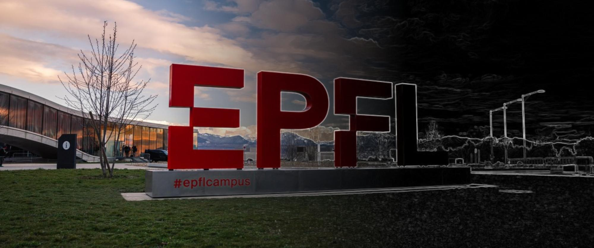

# Awesome Scientific Image Analysis 

A curated list of scientific image analysis resources and software tools.

## 🔖 Getting started

These are our favourite **resources** for learning the basics of image analysis:

- [Image data science with Python and Napari](https://biapol.github.io/Image-data-science-with-Python-and-Napari-EPFL2022/intro.html) - EPFL & TU Dresden
- [Image Processing and Analysis for Life Scientists](https://courseware.epfl.ch/courses/course-v1:EPFL+IPA4LS+2019_t3/about) - BIOP, EPFL
- [Introduction to Bioimage Analysis](https://bioimagebook.github.io/README.html) - Pete Bankheads

Here's a short list of image analysis **software** that we recommend:

- [Fiji](https://fiji.sc/) - ImageJ, with “batteries-included”
- [Ilastik](https://www.ilastik.org/) - Interactive learning and segmentation toolkit
- [Napari](https://napari.org/) - A fast and interactive multi-dimensional image viewer for Python
- [QuPath](https://qupath.github.io/) - Open Software for Bioimage Analysis

Read our **setup guide**:

- [Setting up Python for scientific image analysis](https://imaging.epfl.ch/field-guide/sections/python/notebooks/python_setup.html)

## 🧑‍🤝‍🧑 Communities

- [Image.sc](https://image.sc/)
- [GloBIAS](https://www.globias.org/)
- [SwissBIAS](https://swissbias.github.io/)
<!-- - [Euro-BioImaging](https://www.eurobioimaging.eu/) -->
<!-- - [QUAREP-LiMi](https://quarep.org/) -->
<!-- - [Smart Microscopy](https://smartmicroscopy.org/) -->
<!-- - [BIII.eu](https://biii.eu/) -->

## 📚 Learning resources

**Curated lists**

- [Awesome Biological Image Analysis](https://github.com/hallvaaw/awesome-biological-image-analysis)
- [Awesome Computer Vision](https://github.com/jbhuang0604/awesome-computer-vision)
- [A Hitchhiker's guide through the bio-image analysis software universe](https://febs.onlinelibrary.wiley.com/doi/full/10.1002/1873-3468.14451)
- [ImageScience.org](https://imagescience.org/)

**Guides**

- [Introduction to Bioimage Analysis](https://bioimagebook.github.io/README.html) - Pete Bankheads
- [Image data science with Python and Napari](https://biapol.github.io/Image-data-science-with-Python-and-Napari-EPFL2022/intro.html) - EPFL & TU Dresden
- [The Image Analysis Field Guide](https://imaging.epfl.ch/field-guide/) - EPFL Center for Imaging
<!-- - [Bio-image Analysis Notebooks](https://haesleinhuepf.github.io/BioImageAnalysisNotebooks/intro.html) - Robert Haase -->

**Courses**

- [Image Processing and Analysis for Life Scientists](https://courseware.epfl.ch/courses/course-v1:EPFL+IPA4LS+2019_t3/about) - BIOP, EPFL
- [Introduction to Programming in the Biological Sciences Bootcamp](https://justinbois.github.io/bootcamp/2022_epfl/#) - Justin Bois

**Papers**

- [Towards effective adoption of novel image analysis methods](https://www.nature.com/articles/s41592-023-01910-2) - Talley Lambert, Jennifer Waters
- [Creating and troubleshooting microscopy analysis workflows: Common challenges and common solutions](https://onlinelibrary.wiley.com/doi/full/10.1111/jmi.13288) - Beth Cimini

**Video series**

- [Introduction to bioimage analysis](https://www.youtube.com/watch?v=e-2DbkUwKk4&list=PL5ESQNfM5lc7SAMstEu082ivW4BDMvd0U&index=3)
- [First principles in computer vision](https://www.youtube.com/channel/UCf0WB91t8Ky6AuYcQV0CcLw)
- [DigitalSreeni](https://www.youtube.com/c/DigitalSreeni)
- [Microscopy Series](https://www.ibiology.org/online-biology-courses/microscopy-series/)
- [Microcourses](https://www.youtube.com/@Microcourses/videos)
<!-- - [Optical microscopy Image Processing & analysis](https://www.youtube.com/@johanna.m.dela-cruz/videos) -->
<!-- - [Aits Lab](https://www.youtube.com/channel/UCmh81PBL4lU6r6mcGqhRPbQ/playlists) -->

<!-- **Blogs** -->

<!-- - [Did you know – Image Analysis Style](https://didyouknowimageanalysis.wordpress.com/) - Marie Held -->
<!-- - [My Journey in Image Analysis](https://claudiasc89.github.io/imganalysis3/) - Clàudia Salat -->

## ✂️ Image segmentation

Image segmentation aims to create a segmentation mask that identifies specific classes or objects. Techniques for image segmentation include thresholding, weakly supervised learning (e.g., Ilastik, Weka), and deep learning.

**Learning resources**

- [Thresholding - Introduction to Bioimage Analysis](https://bioimagebook.github.io/chapters/2-processing/3-thresholding/thresholding.html)
- [Thresholding - Scikit-image](https://scikit-image.org/docs/dev/auto_examples/segmentation/plot_thresholding.html)
- [Segmentation - ImageJ Tutorials](https://imagej.net/imaging/segmentation)
- [Image segmentation - Image data science with Python and Napari](https://biapol.github.io/Image-data-science-with-Python-and-Napari-EPFL2022/day2d_image_segmentation/readme.html)

**Software tools**

- [skimage.segmentation](https://scikit-image.org/docs/stable/api/skimage.segmentation.html)
- [Ilastik - Pixel Classification](https://www.ilastik.org/documentation/pixelclassification/pixelclassification)
- [Segment Anything Model 2 (SAM 2)](https://github.com/facebookresearch/sam2)
- [Ultralytics YOLO](https://github.com/ultralytics/ultralytics)
- [rembg](https://github.com/danielgatis/rembg)
- [nnUNet](https://github.com/MIC-DKFZ/nnUNet)
- [segmentation_models](https://github.com/qubvel/segmentation_models)
- [segmentation_models.pytorch](https://github.com/qubvel/segmentation_models.pytorch)
- [Monai](https://github.com/Project-MONAI/MONAI)
- [StarDist](https://github.com/stardist/stardist)
- [CellPose](https://github.com/mouseland/cellpose)
<!-- - [Detectron2](https://github.com/facebookresearch/detectron2) -->
<!-- - [pytorch-3dunet](https://github.com/wolny/pytorch-3dunet) -->
<!-- - [InstanSeg](https://github.com/instanseg/instanseg/tree/main) -->
<!-- - [omnipose](https://github.com/kevinjohncutler/omnipose) -->

## 📐 Image registration

Image registration is used to align multiple images, stabilize sequences by compensating for camera movement, track object movement and deformation, and stitch multiple fields of view together.

**Learning resources**

- [Image correlation - Practice](https://www.spam-project.dev/docs/)
- [Image correlation - Theory](https://www.spam-project.dev/docs/)

**Software tools**

- [skimage.registration](https://scikit-image.org/docs/stable/api/skimage.registration.html)
- [SPAM](https://www.spam-project.dev/)
- [pystackreg](https://github.com/glichtner/pystackreg)
- [TurboReg](https://bigwww.epfl.ch/thevenaz/turboreg/)
- [Warpy](https://imagej.net/plugins/bdv/warpy/warpy)
- [ABBA](https://github.com/BIOP/ijp-imagetoatlas)
<!-- - [pyGPUreg](https://github.com/bionanopatterning/pyGPUreg) -->
<!-- - [Fast4DReg](https://imagej.net/plugins/fast4dreg) -->
<!-- - [SimpleElastix](https://simpleelastix.readthedocs.io/index.html) -->
<!-- - [DIPY](https://github.com/dipy/dipy) -->
<!-- - [ANTsPy](https://github.com/ANTsX/ANTsPy) -->
<!-- - [VoxelMorph](https://github.com/voxelmorph/voxelmorph) -->

## 🪄 Image denoising

Image denoising enhances visual quality by removing noise, making structures more distinguishable and facilitating segmentation through thresholding.

**Learning resources**

- [Noise - Introduction to Bioimage Analysis](https://bioimagebook.github.io/chapters/3-fluorescence/3-formation_noise/formation_noise.html)
- [Denoising a picture (scikit-image)](https://scikit-image.org/docs/stable/auto_examples/filters/plot_denoise.html)

**Software tools**

- [skimage.restoration](https://scikit-image.org/docs/stable/api/skimage.restoration.html)
- [Noise2Void](https://github.com/juglab/n2v)
<!-- - [Aydin](https://github.com/royerlab/aydin) -->

## 🔍 Object detection

Object detection is the process of identifying and localizing objects within an image or video using various shapes such as bounding boxes, keypoints, circles, or other geometric representations.

**Software tools**

- [Ultralytics YOLO](https://github.com/ultralytics/ultralytics)
- [DeepLabCut](https://www.mackenziemathislab.org/deeplabcut)
- [OpenPifPaf](https://github.com/openpifpaf/openpifpaf)
- [Spotiflow](https://github.com/weigertlab/spotiflow)
<!-- - [Detectron2](https://github.com/facebookresearch/detectron2) -->

## 🐾 Tracking

Object tracking is the process of following objects across time in a video or image time series.

**Learning resources**

- [Single cell tracking with napari](https://napari.org/stable/tutorials/tracking/cell_tracking.html)
- [Walkthrough (trackpy)](https://soft-matter.github.io/trackpy/dev/tutorial/walkthrough.html)
- [Getting started with TrackMate](https://imagej.net/plugins/trackmate/tutorials/getting-started)
<!-- - [Trackmate Introduction and Demo](https://www.youtube.com/watch?v=7HWtaikIFcs) -->

**Software tools**

- [TrackMate](https://imagej.net/plugins/trackmate/)
- [Trackpy](https://github.com/soft-matter/trackpy)
- [Trackastra](https://github.com/weigertlab/trackastra)
- [ultrack](https://github.com/royerlab/ultrack)
- [co-tracker](https://github.com/facebookresearch/co-tracker)
- [LapTrack](https://github.com/yfukai/laptrack)

## 🌻 Visualization

A variety of software tools are available for visualizing scientific images and their associated data.

**Learning resources**

- [Visual image comparison (Scikit-image)](https://scikit-image.org/docs/stable/auto_examples/applications/plot_image_comparison.html#sphx-glr-auto-examples-applications-plot-image-comparison-py)

**Software tools**

- [Fiji](https://fiji.sc/)
- [Napari](https://napari.org/stable/)
- [QuPath](https://qupath.github.io/)
- [Paraview](https://www.paraview.org/)
- [Neuroglancer](https://github.com/google/neuroglancer)
- [pyvista](https://pyvista.org/)
- [vedo](https://github.com/marcomusy/vedo)
- [tif2blender](https://github.com/oanegros/tif2blender)
- [NeuroMorph](https://github.com/NeuroMorph-EPFL/NeuroMorph)
- [BigDataViewer](https://imagej.net/plugins/bdv/)
<!-- - [3D Slicer](https://www.slicer.org/) -->
<!-- - [microfilm](https://github.com/guiwitz/microfilm) -->
<!-- - [microviewer](https://github.com/seung-lab/microviewer) -->
<!-- - [vizarr](https://github.com/hms-dbmi/vizarr) -->
<!-- - [ndv](https://github.com/pyapp-kit/ndv) -->
<!-- - [hyperspy](https://github.com/hyperspy/hyperspy) -->
<!-- - [ITK-SNAP](http://www.itksnap.org/pmwiki/pmwiki.php) -->
<!-- - [MITK](https://www.mitk.org/wiki/The_Medical_Imaging_Interaction_Toolkit_(MITK)) -->
<!-- - [3D Viewer](https://imagej.net/plugins/3d-viewer/) -->

## 🔋 Performance

Performance optimization is the process of making code execution faster, more efficient, or using fewer computing resources.

**Learning resources**

- [System aspects - Basics of Computing Environments for Scientists](https://compenv.phys.ethz.ch/system_aspects/)
- [Accelerated large-scale image procesing in Python](https://github.com/EPFL-Center-for-Imaging/accel-large-image-proc-talk)

**Software tools**

- [pyclesperanto_prototype](https://github.com/clEsperanto/pyclesperanto_prototype)
- [Numba](https://numba.pydata.org/)
- [cuCIM](https://github.com/rapidsai/cucim)
- [OpenCV](https://opencv.org/)

## 🕊️ Open science

Open imaging science meets principles of findability, accessibility, interoperability, and reusability (FAIR).

**Software development practices**

- [The Turing Way handbook](https://the-turing-way.netlify.app/index.html)
- [Code Publishing cheat sheet](https://www.epfl.ch/schools/enac/wp-content/uploads/2022/06/ENAC-IT4R_Code_Publishing_Cheat_Sheet.pdf)
- [Good enough practices in scientific computing](https://journals.plos.org/ploscompbiol/article?id=10.1371/journal.pcbi.1005510)

**Reproducibility**

- [Reproducible image handling and analysis](https://www.embopress.org/doi/full/10.15252/embj.2020105889)
- [Understanding metric-related pitfalls in image analysis validation](https://arxiv.org/abs/2302.01790)
- [Reporting reproducible imaging protocols](https://www.sciencedirect.com/science/article/pii/S2666166722009194?via%3Dihub)
- [When seeing is not believing: application-appropriate validation matters for quantitative bioimage analysis](https://www.nature.com/articles/s41592-023-01881-4)
<!-- - [Processing images for papers & posters](https://osf.io/a8hb6) -->

**Figures creation**

- [Community-developed checklists for publishing images and image analysis](https://arxiv.org/abs/2302.07005)
- [Creating Clear and Informative Image-based Figures for Scientific Publications](https://www.biorxiv.org/content/10.1101/2020.10.08.327718v2)
- [Effective image visualization for publications – a workflow using open access tools and concepts](https://f1000research.com/articles/9-1373)
<!-- - [Publishing images for papers & posters](https://osf.io/mxhve) -->

## 🐍 Python

Python is a popular programming language for scientific image analysis.

**Python setup**

- [Setting up Python for scientific image analysis](https://imaging.epfl.ch/field-guide/sections/python/notebooks/python_setup.html)
- [Managing Conda Environments](https://conda.io/projects/conda/en/latest/user-guide/tasks/manage-environments.html)
- [Conda Cheatsheet](https://docs.conda.io/projects/conda/en/latest/_downloads/843d9e0198f2a193a3484886fa28163c/conda-cheatsheet.pdf)
- [Python environments workshop](https://hackmd.io/@talley/SJB_lObBi) - Talley Lambert

**Python programming**

- [Python 3 documentation](https://docs.python.org/3/)
- [Automate the Boring Stuff with Python](https://automatetheboringstuff.com/)
- [Programming with Python](https://swcarpentry.github.io/python-novice-inflammation/index.html) - Software Carpentry
- [pydevtips: Python Development Tips](https://pydevtips.readthedocs.io/en/latest/index.html) - Eric Bezzam
- [Python packaging 101](https://www.pyopensci.org/python-package-guide/tutorials/intro.html)

**Python for image processing**

- [Image processing with Python](https://github.com/guiwitz/Python_image_processing) - Guillaume Witz
- [User Guide](https://scikit-image.org/docs/stable/) - Scikit-image
- [3.3. Scikit-image: image processing](https://scipy-lectures.org/packages/scikit-image/index.html) - Scientific Python Lectures
- [Image processing with Python](https://datacarpentry.org/image-processing/) - Data Carpentry

## 🔬 Fiji (ImageJ)

Fiji is an open-source software for image processing and analysis. A wide range of community-developed plugins can enhance its functionality.

**Learning resources**

- [Scientific Imaging Tutorials](https://imagej.net/imaging/index) - ImageJ
- [Image handling using Fiji - training materials](https://zenodo.org/records/14771563) - Joanna Pylvänäinen
<!-- - [Fiji Programming Tutorial](https://syn.mrc-lmb.cam.ac.uk/acardona/fiji-tutorial/) -->

**Plugins**

- [ThunderSTORM](https://github.com/zitmen/thunderstorm)
- [MorphoLibJ](https://imagej.net/plugins/morpholibj)
- [OrientationJ](https://bigwww.epfl.ch/demo/orientationj/)

## 🏝️ Napari

Napari is a fast and interactive multi-dimensional image viewer for Python. It can be used for browsing, annotating, and analyzing scientific images.

**Learning resources**

- [napari.org](https://napari.org/stable/)

**Plugins**

- [napari-animation](https://github.com/napari/napari-animation)
- [napari-skimage-regionprops](https://github.com/haesleinhuepf/napari-skimage-regionprops)
- [Omega](https://github.com/royerlab/napari-chatgpt)
- [napari-threedee](https://github.com/napari-threedee/napari-threedee)

## 🧬 QuPath

QuPath is an open software for bioimage analysis, often used to process and visualize digital pathology and whole slide images.

**Learning resources**

- [qupath.github.io](https://qupath.github.io)

**Extensions**

- [qupath-extension-cellpose](https://github.com/BIOP/qupath-extension-cellpose)
- [qupath-extension-stardist](https://github.com/qupath/qupath-extension-stardist)
- [qupath-extension-sam](https://github.com/ksugar/qupath-extension-sam)

## 🛸 Other

**🤖 LLMs**

- [bia-bob](https://github.com/haesleinhuepf/bia-bob)
- [BioImage.IO Chatbot](https://github.com/bioimage-io/bioimageio-chatbot)

**📷 Image acquisition**

- [Cameras and Lenses](https://ciechanow.ski/cameras-and-lenses/)
- [Knowledge Center](https://www.edmundoptics.eu/knowledge-center) - Edmund Optics
<!-- - [Guides - Center for Microscopy and Image Analysis](https://zmb.dozuki.com/) - University of Zurich -->

**🩻 Image reconstruction**

- [Pyxu](https://pyxu-org.github.io/)
<!-- - [Welcome to Inverse Problems and Imaging](https://tristanvanleeuwen.github.io/IP_and_Im_Lectures/intro.html) -->

**👓 Depth estimation**

- [Depth Anything](https://github.com/LiheYoung/Depth-Anything)

**💲 Splines**

- [SplineBox](https://splinebox.readthedocs.io/en/latest/index.html)

**🍭 Orientation**

- [OrientationPy](https://epfl-center-for-imaging.gitlab.io/orientationpy/introduction.html)